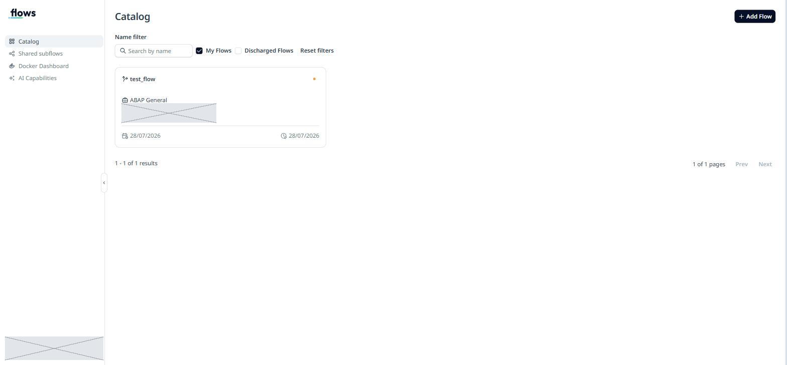
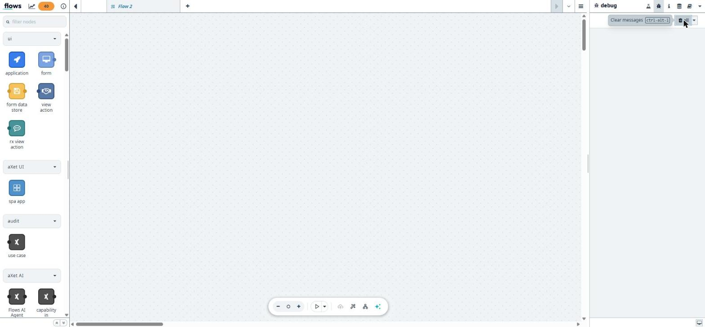

# 1. Kurulum

Bu bölüm, aXet.flows'u çalışır hale getirmenin tüm adımlarını içerir.
Sırayla ilerle — her adımın sonunda bir **doğrulama** komutu var.

## 1.1 Mimariyi anla (5 dakika, atlamayın)

Kurulum sırasında ne olduğunu bilmezseniz hata mesajları anlamsız gelir.
Zincir şöyle:

```
Tarayıcı (portal)          → axet.nttdata.com/flows
       │                     katalog, versiyon, dağıtım yönetimi
       ▼
aXet.flows Desktop         → yerel ajan, https://localhost:65430
       │                     portal ile Docker arasında köprü
       ▼
WSL2 dağıtımı              → aXet-flows_WSL
       │                     uygulama bunu kendisi kurar
       ▼
Docker                     → WSL içinde çalışır
       │
       ▼
Tasarımcı konteyneri       → http://127.0.0.1:<port>
                             Node-RED editörü burada
```

**Kritik nokta:** Bu zincirin herhangi bir halkası kopuksa portal
"Internal server error" verir. Hata portalda görünür ama sebebi
neredeyse her zaman yerel taraftadır.

## 1.2 Ön kontroller

Kuruluma başlamadan önce makinenin uygun olduğunu doğrulayın.

### aXet.flows Desktop kurulu mu?

PowerShell'de:

```powershell
Test-Path 'C:\ProgramData\NTT\axetflows-desktop\axetflows-desktop-win-prod\aXet.flows-Desktop.exe'
```

`True` dönmeli. `False` ise uygulama kurulu değil — IT'den talep edin.

> **Not:** aXet.flows Desktop, Programlar ve Özellikler listesinde **görünmez**.
> Klasik MSI kurulumu değil, `C:\ProgramData\NTT\` altına dağıtılıyor.
> "Kurulu değil" sonucuna varmadan önce klasörü kontrol edin.

### WSL platformu etkin mi?

```powershell
wsl.exe --version
```

Sürüm bilgisi dönüyorsa WSL kurulu ve etkindir. Hata veriyorsa
**bu adım için yönetici hakkı gerekir**, IT'ye başvurun.

Özelliklerin durumunu görmek için:

```powershell
Get-CimInstance Win32_OptionalFeature -Filter "Name='VirtualMachinePlatform' OR Name='Microsoft-Windows-Subsystem-Linux'" |
  Select-Object Name, InstallState
```

`InstallState = 1` → etkin.

### Docker Desktop gerekiyor mu?

**Hayır.** aXet.flows Desktop kendi WSL dağıtımını (`aXet-flows_WSL`) kurar ve
Docker'ı onun içinde çalıştırır. Docker Desktop kurmanıza gerek yok, hatta
kurmayın — çakışabilir.

Bu, kurulumun en çok yanlış bilinen kısmı: WSL platformu zaten etkinse
**yönetici hakkı olmadan** tüm kurulum tamamlanır.

### Portal erişilebilir mi?

```powershell
(Invoke-WebRequest -Uri 'https://axet.nttdata.com/flows/frontend/' -UseBasicParsing).StatusCode
```

`200` dönmeli. Dönmüyorsa VPN/ağ sorunudur.

## 1.3 Masaüstü uygulamasını başlat

Başlat Menüsü → **aXet.flows Desktop**

İlk açılışta uygulama şunları yapar:

1. WSL dağıtımını indirir ve kurar (`aXet-flows_WSL`)
2. İçinde Docker'ı başlatır
3. SSH proxy'yi ayağa kaldırır (Windows ↔ WSL köprüsü)

Bu birkaç dakika sürer. Windows ayrıca *"Linux için Windows Alt Sistemi'ne
hoş geldiniz"* penceresini açabilir — **zararsızdır, kapatın.**

### ⚠️ Bilinen tuzak: "Starting SSH proxy for mirrored networking mode..."

Uygulama bu ekranda **takılı kalabilir** (yarım saat bekledik, geçmedi).
Sebebi, SSH proxy adımının WSL dağıtımının ilk kurulumuyla yarışması.

**Çözüm: uygulamayı kapatıp yeniden açın.** İkinci açılışta altyapı hazır
olduğu için sorunsuz geçer.

PowerShell ile:

```powershell
Stop-Process -Name 'aXet.flows-Desktop' -Force -ErrorAction SilentlyContinue
Stop-Process -Name 'win-sshproxy' -Force -ErrorAction SilentlyContinue
Start-Sleep -Seconds 4
Start-Process 'C:\ProgramData\NTT\axetflows-desktop\axetflows-desktop-win-prod\aXet.flows-Desktop.exe'
```

### Doğrulama

Aşağıdakilerin hepsi geçmeli:

```powershell
# 1. WSL dağıtımı çalışıyor mu?
wsl.exe -l -v
#    aXet-flows_WSL   Running   2   görmelisiniz

# 2. Docker ayakta mı?
wsl.exe -d aXet-flows_WSL -- docker version --format '{{.Server.Version}}'
#    örn. 20.10.24+dfsg1

# 3. Yerel ajan dinliyor mu?
(Invoke-WebRequest -Uri 'https://localhost:65430/api/health' -SkipCertificateCheck -SkipHttpErrorCheck).StatusCode
#    401 normaldir — sunucu ayakta, sadece yetkisiz. 000/hata ise ajan çalışmıyor.

# 4. SSH proxy bağlantısı kuruldu mu?
netstat -ano | Select-String ':2222'
#    ESTABLISHED satırı görmelisiniz
```

## 1.4 Portala giriş

1. Tarayıcıda `https://axet.nttdata.com/flows/frontend/` açın
2. Okta giriş ekranına yönlendirilirsiniz (*"aXet Platform erişimi için
   hesabınızla oturum açın"*)
3. NTT kurumsal hesabınızla girin + MFA onayı

Giriş sonrası **Catalog** ekranını görürsünüz:



Sol menü:

- **Catalog** — akışlarınız
- **Shared subflows** — paylaşılan alt akışlar
- **Docker Dashboard** — yerel konteyner durumu
- **AI Capabilities** — yapay zekâ düğümleri

### Doğrulama

**Docker Dashboard**'a girin. İki kutu görmelisiniz: *In Design* ve
*Production mode*, ikisi de **Not Running**.

Tasarımcı çalışmaya başladığında bu ekran şöyle görünür:


> 💡 **İpucu:** Bu ekrandaki **"Flows designer port"** satırı tasarımcının
> adresini doğrudan verir (`http://localhost:16267` gibi). Port her açılışta
> değiştiği için tasarımcıyı kaybederseniz buraya bakın — komut satırına
> gerek yok.

Bunun yerine kırmızı bir hata çıkarsa:

> **Internal server error** — Docker container connection error.
> Please ensure that the container runtime is running.

...yerel ajan/Docker ayakta değil demektir. 1.3'e dönün.

## 1.5 Tasarımcıyı ilk kez aç

1. **Catalog** → bir flow kartına tıklayın (yoksa **+ Add Flow** ile oluşturun)
2. Sağ üstte **+ New Version**
3. Uyarıyı onaylayın:

   > **Warning!** Editing this Axet Flow will prevent other users from editing it.

   Bu, flow'a **size özel düzenleme kilidi** alır. Onaylayın.

4. Deploy seçeneği sorulur → **Regular Deployment**
5. **Docker imajı iner — ilk seferde ~2.2 GB, 5-15 dakika sürebilir.**
   İlerleme çubuğu portalda görünür.
6. İmaj indikten sonra:

   > Do you want open recent running Axet Flow instance in a new browser tab?

   → **Yes**. Tasarımcı yeni sekmede açılır.

### Doğrulama

Yeni sekmede Node-RED tabanlı editör açılmalı: solda düğüm paleti,
ortada tuval, sağda debug paneli. Adres `http://127.0.0.1:<port>` biçiminde.



Konteyneri komut satırından da görebilirsiniz:

```powershell
wsl.exe -d aXet-flows_WSL -- docker ps
```

`deptapps-flows-designer-container-...` adında, **healthy** durumda bir
konteyner ve `...->1880/tcp` port eşlemesi görmelisiniz.
**1880, Node-RED'in standart portudur** — tasarımcının Node-RED olduğunu
buradan anlarsınız.

## 1.6 İşiniz bitince: kilidi bırakın

Tasarımı bitirdiğinizde **Catalog** → flow kartının `…` menüsü →
**Unblock Flow**.

Bunu yapmazsanız o flow'u **başka kimse düzenleyemez**. Ekip
çalışmasında en sık şikâyet konusu budur.

---

**Sonraki adım:** [2. İlk Akış](02-ilk-akis.md)
