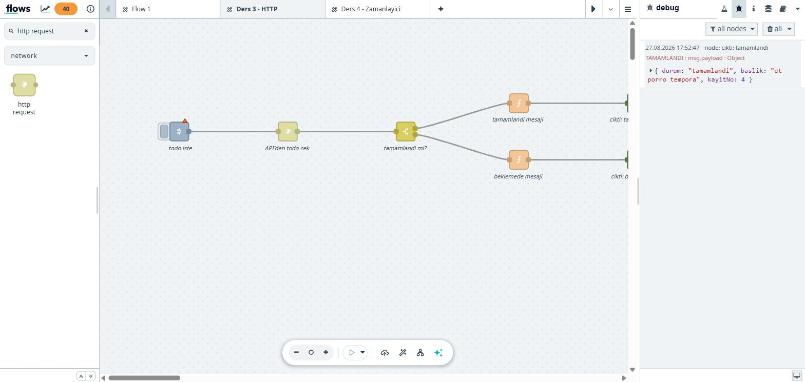

# 3. Dış Veri ve Dallanma: HTTP + switch

Ders 2'de veriyi kendimiz ürettik. Gerçek otomasyonda veri **dışarıdan** gelir
ve her zaman beklediğiniz biçimde gelmez. Bu derste bir API'den veri çekip,
gelen içeriğe göre akışı ikiye ayıracağız.

Kuracağımız akış:

```
inject ──► http request ──► switch ──┬──► function "tamamlandı" ──► debug
                                     │
                                     └──► function "beklemede"  ──► debug
```

## 3.1 Kullanacağımız API

Ücretsiz bir test servisi: `jsonplaceholder.typicode.com`

```
GET https://jsonplaceholder.typicode.com/todos/1
```

Dönen yanıt:

```json
{
  "userId": 1,
  "id": 1,
  "title": "delectus aut autem",
  "completed": false
}
```

`completed` alanı bizim dallanma ölçütümüz olacak.

| Kayıt | `completed` |
|---|---|
| `todos/1` | `false` |
| `todos/4` | `true` |

İki farklı sonucu test edebilmemiz için ikisi de lazım.

> **Kurumsal ağ notu:** Konteynerin dış dünyaya erişimi kısıtlı olabilir.
> `403 Forbidden` veya `504 Gateway Time-out` alıyorsanız proxy engeline
> takılmışsınızdır — `http request` düğümündeki **"Use proxy"** seçeneğini
> kullanmanız gerekir. Erişimi önceden test etmek için:
>
> ```powershell
> $k = wsl.exe -d aXet-flows_WSL -- docker ps --format "{{.Names}}"
> wsl.exe -d aXet-flows_WSL -- docker exec $k curl -s -o /dev/null -w "%{http_code}" https://jsonplaceholder.typicode.com/todos/1
> ```
>
> `200` görmelisiniz.

## 3.2 Adım 1 — Veriyi çekin (henüz ayrıştırmadan)

1. Yeni bir akış sekmesi açın (üstteki **+**)
2. `inject` düğümü ekleyin
3. Aramaya `http request` yazın — **network** kategorisinde çıkar — ekleyin
4. `debug` düğümü ekleyin
5. Üçünü sırayla bağlayın

`http request` düğümüne çift tıklayın:

| Ayar | Değer |
|---|---|
| Method | `GET` |
| URL | `https://jsonplaceholder.typicode.com/todos/1` |
| Return | **a UTF-8 string** (şimdilik böyle bıraktık) |

Deploy edin, `inject`'e basın. Debug panelinde:

```
msg.payload : string[83]
"{  "userId": 1,  "id": 1,  "title": "delectus aut autem",  "completed": fals..."
```

## 3.3 En kritik ayar: Return tipi

Yukarıdaki çıktıya dikkat edin: **`string[83]`**.

İçerik JSON *gibi görünüyor* ama Node-RED için bu sadece 83 karakterlik bir
metin. `msg.payload.completed` yazarsanız `undefined` gelir, `switch` hiçbir
dala giremez ve akış sessizce ölür.

**Çözüm:** `http request` düğümünü açın, **Return** ayarını
**"a parsed JSON object"** yapın.

Deploy edip tekrar tetikleyin:

```
msg.payload : Object
{ userId: 1, id: 1, title: "delectus aut autem", completed: false }
```

Artık `Object` yazıyor — içindeki alanlara erişebilirsiniz.

> 💡 **Kural:** Debug panelindeki tip etiketi (`string[83]` / `Object`),
> gözünüzle okuduğunuz içerikten daha güvenilir bilgidir. Bir şey
> çalışmıyorsa önce tipe bakın.

## 3.4 Adım 2 — switch ile dallanma

`switch` düğümü akışın `if/else`'idir, ama tek farkla: **her koşul ayrı bir
çıkış portu üretir.**

Paletten `switch` ekleyin, `http request` ile `debug` arasına alın. Çift
tıklayıp ayarlayın:

| Alan | Değer |
|---|---|
| Property | `msg.` `payload.completed` |
| 1. kural | `is true` |
| 2. kural | `is false` |

Nokta notasyonuna dikkat: `payload.completed` yazarak nesnenin **içine**
iniyoruz. Ders 2'de payload'ı nesne yapmamızın karşılığı bu.

Kaydettiğinizde düğümün sağında **iki çıkış portu** belirir:

- **1. port** = 1. kural (`is true`)
- **2. port** = 2. kural (`is false`)

> **Port sırası = kural sırasıdır.** Kuralları yukarı/aşağı taşırsanız
> kablolarınız yanlış dala bağlanır.

### "otherwise" kuralı

Hiçbir kural tutmazsa mesaj **hiçbir yere gitmez** — sessizce kaybolur.
Beklenmedik veriyi yakalamak için son kural olarak `otherwise` ekleyip bir
debug'a bağlamak iyi bir alışkanlıktır.

### checkall ayarı

Düğümün altındaki açılır menüde iki seçenek var:

- **"stopping after first match"** — ilk eşleşmede durur (varsayılan, genelde doğru)
- **"checking all rules"** — tüm kuralları dener, mesaj birden fazla daldan çıkabilir

## 3.5 Adım 3 — İki dalı biçimlendirin

Her çıkışa birer `function` düğümü ekleyin.

**1. port (tamamlandı):**

```javascript
msg.topic = "TAMAMLANDI";
msg.payload = {
    durum:   "tamamlandi",
    baslik:  msg.payload.title,
    kayitNo: msg.payload.id
};
return msg;
```

**2. port (beklemede):**

```javascript
msg.topic = "BEKLEMEDE";
// Ayni alan adlarini kullaniyoruz ki iki dal ileride birlesebilsin
msg.payload = {
    durum:   "beklemede",
    baslik:  msg.payload.title,
    kayitNo: msg.payload.id
};
return msg;
```

Her birinin sonuna bir `debug` bağlayın ve isimlendirin
(`cikti: tamamlandi`, `cikti: beklemede`).

### Neden aynı alan adları?

Bu bir tasarım kararıdır:

| Yaklaşım | Sonuç |
|---|---|
| **Aynı alanlar** (`durum`, `baslik`, `kayitNo`) | Dallar ileride birleşip tek tabloya dönüşebilir, raporlanabilir |
| **Farklı alanlar** | Her dal kendine özel bilgi taşır ama tek tiplik bozulur |

Soru şu: *dallar ileride tekrar birleşecek mi?* Birleşecekse tek tip yapın.

## 3.6 Test: her iki dalı da çalıştırın

**Test 1 —** URL `todos/1` (completed: false):

```
[cikti: beklemede]  { durum: 'beklemede', baslik: 'delectus aut autem', kayitNo: 1 }
```

**Test 2 —** `http request` düğümünü açıp URL'yi `todos/4` yapın
(completed: true), deploy edin, tetikleyin:

```
[cikti: tamamlandi]  { durum: 'tamamlandi', baslik: 'et porro tempora', kayitNo: 4 }
```



Aynı akış, sadece kaynak veri değişti — ve mesaj kendiliğinden öbür dala aktı.
Switch, function'lar, kablolar hiç değişmedi. **İyi tasarlanmış akış, veriye
göre kendi yolunu bulur.**

## 3.7 Hazır akışı import etmek

1. Tasarımcıda **☰ menü → Import**
2. [`kaynaklar/ornek-03-http-dallanma.json`](kaynaklar/ornek-03-http-dallanma.json)
   içeriğini yapıştırın
3. **Import** → **Deploy**

## 3.8 Alıştırmalar

1. **Kolay** — `switch` düğümüne üçüncü bir kural olarak `otherwise` ekleyin,
   bir debug'a bağlayın. URL'yi olmayan bir kayda (`todos/9999`) çevirip ne
   olduğunu gözleyin.
2. **Orta** — Dallanmayı `completed` yerine `userId` alanına göre yapın
   (`== 1` / `otherwise`). Property alanına ne yazmanız gerekir?
3. **Zor** — İki dalın çıkışını **aynı** debug düğümüne bağlayın. Tek tip alan
   adları seçmenin faydası burada ortaya çıkar. Sonra `msg.topic` sayesinde
   hangisinin hangi dal olduğunu ayırt edebiliyor musunuz?

---

**Sonraki adım:** [4. Zamanlanmış Akış ve Dosya Yazma](04-zamanlayici-dosya.md)
