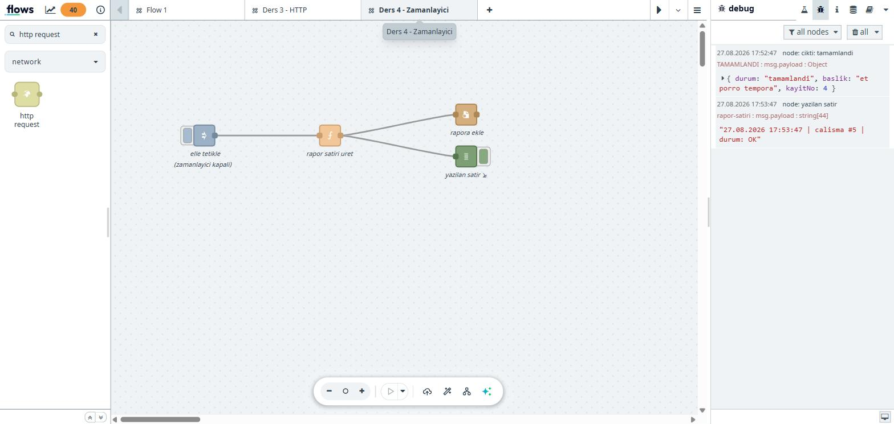

# 4. Zamanlanmış Akış ve Dosya Yazma

Şimdiye kadar akışları hep **elle** tetikledik ve çıktılar debug panelinde
kaldı — tarayıcıyı kapatınca uçtu.

Gerçek otomasyonda ikisi de böyle olmaz: iş kendi kendine çalışır ve sonucu
bir yere kalıcı olarak bırakır. Bu ders o ikisini öğretiyor.

Kuracağımız akış:

```
her 20 sn ──► rapor satırı üret ──┬──► dosyaya EKLE
 (inject)        (function)        │      (file)
                                   └──► debug
```

## 4.1 Dosya nereye yazılır? (Konteyner ↔ Windows köprüsü)

Akışlarınız bir Docker konteynerinin içinde çalışır. Konteyner izole bir
ortamdır — oraya yazdığınız dosya normalde konteyner ölünce kaybolur.

Ama aXet.flows bazı klasörleri Windows'unuzla **paylaşır**:

| Konteyner içi yol | Windows karşılığı |
|---|---|
| `/internal-storage-files/files/` | `%LOCALAPPDATA%\axet-flows\.deptapps-instances-in-designer-mode\<no>\files\` |
| `/external-repository-files/` | `%LOCALAPPDATA%\axet-flows\.deptapps-desktop\repository-files\` |
| `/data` | Docker volume (Windows'tan doğrudan görünmez) |

**Kendi makinenizdeki eşleşmeyi görmek için:**

```powershell
$k = wsl.exe -d aXet-flows_WSL -- docker ps --format "{{.Names}}"
wsl.exe -d aXet-flows_WSL -- docker inspect $k --format '{{range .Mounts}}{{.Source}} -> {{.Destination}}{{\"`n\"}}{{end}}'
```

Örnek çıktı:

```
/mnt/c/Users/<kullanici>/AppData/Local/axet-flows/.deptapps-instances-in-designer-mode/25708 -> /internal-storage-files
/mnt/c/Users/<kullanici>/AppData/Local/axet-flows/.deptapps-desktop/repository-files      -> /external-repository-files
```

> ⚠️ **Yol seçimi kritik.** `/tmp/rapor.txt` yazarsanız dosya konteyner ölünce
> buhar olur. `/internal-storage-files/files/rapor.txt` yazarsanız kalıcıdır ve
> Windows Gezgini'nden açılabilir.
>
> RPA'da "çıktıyı nereye bırakayım" sorusunun cevabı budur — Excel'e,
> paylaşılan klasöre, e-postaya giden her şey bu köprüden geçer.

## 4.2 Adım 1 — Zamanlayıcıyı kurun

Yeni bir akış sekmesi açın, bir `inject` düğümü ekleyin ve çift tıklayın.

**Repeat** açılır menüsünde üç seçenek var:

| Seçenek | Ne yapar | Ne zaman |
|---|---|---|
| **none** | Sadece elle tetiklenir | Geliştirme/test |
| **interval** | Her N saniye/dakika/saatte bir | Sık tekrarlayan işler |
| **interval between times** | Belirli saatler arasında, N dakikada bir | Mesai saatleri |
| **at a specific time** | Günün belirli saatinde (cron) | "Her sabah 08:00" |

Bu ders için: **interval → every 20 seconds**

`Name` alanına `her 20 saniyede` yazın.

> **Üretimde 20 saniye kullanmayın.** Test için kısa tuttuk. Gerçek işlerde
> genelde `at a specific time` (günlük) veya saatlik aralıklar kullanılır.

## 4.3 Adım 2 — Rapor satırını üretin

Bir `function` düğümü ekleyin, adını `rapor satiri uret` koyun:

```javascript
const t = new Date();

// Sayac: flow context akis yeniden baslayana kadar yasar
let sayac = flow.get("calismaSayisi") || 0;
sayac = sayac + 1;
flow.set("calismaSayisi", sayac);

const zaman = t.toLocaleString("tr-TR");

// file dugumu msg.payload icindeki METNI yazar
msg.payload = `${zaman} | calisma #${sayac} | durum: OK`;
msg.topic = "rapor-satiri";

return msg;
```

### Akışın hafızası: context

Bu kodun kalbi `flow.get` / `flow.set` satırları. Normal bir değişken her
mesajda sıfırlanır; sayaç hep 1 kalırdı. Context, değeri **çalışmalar
arasında** saklar.

Üç katman vardır:

| Katman | Kapsam | Kullanım |
|---|---|---|
| `context` | Sadece o düğüm | Düğüme özel durum |
| `flow` | O akış sekmesi | Aynı akıştaki düğümler paylaşır |
| `global` | Tüm akışlar | Ortak ayarlar, sayaçlar |

> **Dikkat:** Context varsayılan olarak **bellekte** tutulur. Konteyner
> yeniden başlarsa sıfırlanır. Kalıcı olması gereken sayaçları dosyaya veya
> veritabanına yazın.

### Neden `msg.payload` metin?

`file` düğümü `msg.payload` içindeki **metni** dosyaya yazar. Nesne
verirseniz `[object Object]` yazar. Ders 3'te nesne döndürmüştük — burada
tersi doğru. **Bir sonraki düğüm neyi bekliyorsa onu üretin.**

## 4.4 Adım 3 — Dosyaya yazın

Paletten `file` düğümü ekleyin (kategori: **storage**) ve ayarlayın:

| Ayar | Değer |
|---|---|
| Filename | `/internal-storage-files/files/akis-raporu.txt` |
| Action | **Append to file** |
| Add newline to each payload | ✅ işaretli |
| Create directory if it doesn't exist | ✅ işaretli |
| Encoding | `utf8` |

### Append mi Overwrite mı?

| Action | Sonuç |
|---|---|
| **Append to file** | Her çalışmada satır eklenir → log birikir |
| **Overwrite file** | Her çalışmada dosya sıfırlanır → sadece son durum kalır |

Log biriktirmek ile anlık durum yazmak arasındaki fark bu tek ayarda.

## 4.5 Adım 4 — Çıkışı ikiye bölün

`function` düğümünün çıkışından **iki kablo** çekin: biri `file`'a, biri
`debug`'a.

Bir çıkış portundan istediğiniz kadar kablo çekebilirsiniz — mesajın
kopyası her birine gider. Böylece hem dosyaya yazarsınız hem ekranda
izlersiniz.

## 4.6 Test

Deploy edin ve **hiçbir şey yapmayın.** Akış kendi kendine çalışmaya başlar.

20-60 saniye bekleyip dosyayı Windows'tan okuyun:

```powershell
$yol = "$env:LOCALAPPDATA\axet-flows\.deptapps-instances-in-designer-mode"
Get-ChildItem $yol -Recurse -Filter 'akis-raporu.txt' | Get-Content
```

Görmeniz gereken:

```
27.08.2026 17:44:23 | calisma #1 | durum: OK
27.08.2026 17:44:43 | calisma #2 | durum: OK
27.08.2026 17:45:03 | calisma #3 | durum: OK
```



Tam 20 saniye aralıklarla, sayaç artarak. Dosyayı Not Defteri ile de
açabilirsiniz — konteynerin yazdığını Windows'tan okuyorsunuz.

## 4.7 ⚠️ Akışı durdurmayı unutmayın

Bu akış **siz durdurana kadar** çalışır. Test bitince:

`inject` düğümüne çift tıklayın → **Repeat: none** → **Done** → **Deploy**

Doğrulama: 30 saniye bekleyip dosyanın satır sayısının artmadığını kontrol edin.

> Unutulmuş bir zamanlayıcı, günlerce dosya şişirir veya bir API'yi
> gereksiz yere yorar. Ekip ortamında en sık yapılan hatalardan biridir.

## 4.8 Hazır akışı import etmek

1. **☰ menü → Import**
2. [`kaynaklar/ornek-04-zamanlayici-dosya.json`](kaynaklar/ornek-04-zamanlayici-dosya.json)
   içeriğini yapıştırın
3. **Import** → **Deploy**

> Bu örnek **20 saniyelik zamanlayıcı açık** halde gelir. Test edip
> kapatmayı unutmayın.

## 4.9 Alıştırmalar

1. **Kolay** — `file` düğümünü **Overwrite** moduna alın. Dosyada ne değişti?
2. **Orta** — Rapor satırına Ders 3'ten öğrendiğinizi ekleyin: satır sonuna
   çalışma saatinin dakikasını yazın ve `flow.set` ile ortalama alın.
3. **Zor** — Ders 3'ün API akışını bu derse bağlayın: her 30 saniyede bir
   API'den todo çekin, `completed` durumuna göre **iki farklı dosyaya**
   yazın (`tamamlananlar.txt` / `bekleyenler.txt`). Dört dersin hepsi tek
   akışta birleşir.

---

**Takıldınız mı?** → [Sorun Giderme](SORUN-GIDERME.md)
