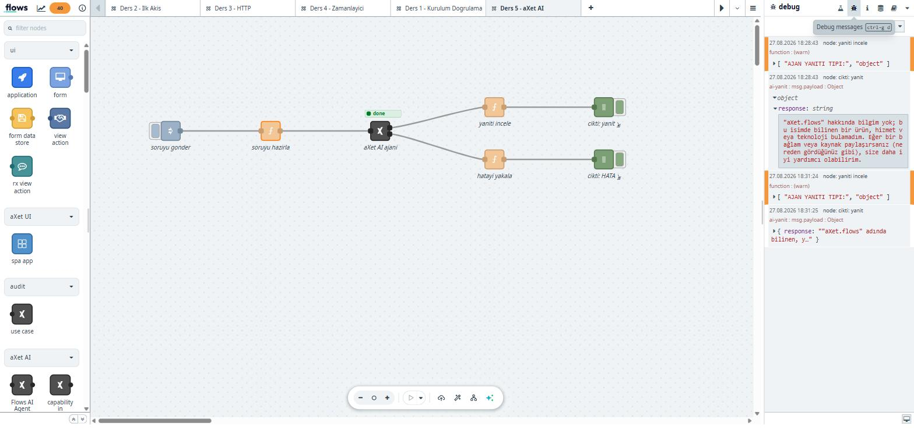

# 5. aXet AI Ajanı

Bu ders, aXet.flows'u sıradan bir Node-RED kurulumundan ayıran kısma giriyor:
akışın içinden bir **yapay zekâ ajanı** çalıştırmak.

Kuracağımız akış:

```
inject ──► soruyu hazırla ──► aXet AI ajanı ──┬──► yanıtı incele ──► debug
                               (2 çıkışlı)     │
                                               └──► hatayı yakala ──► debug
```

## 5.1 aXet.flows'un AI tarafı iki yönlüdür

Platformda iki ayrı yaklaşım var; karıştırmayın:

| Yön | Düğüm | Ne yapar |
|---|---|---|
| **Akıştan AI'ya** | `Flows AI Agent` (`axet-agents-execute`) | Akışınız bir modele soru sorar, yanıtı akışta kullanır |
| **AI'dan akışa** | `capability in` / `capability out` | Akışınızı, AI ajanlarının çağırabileceği bir **araç** olarak yayınlar |

Bu ders birincisini anlatıyor. İkincisi için portaldaki **AI Capabilities**
menüsüne bakın — orada `add`, `subtract`, `multiply` gibi hazır MCP araçları
ve her birinin sözleşmesi (girdi/çıktı şeması, endpoint) listelenir.

> **MCP nedir?** Model Context Protocol. Bir dil modeli tek başına sadece
> metin üretir; MCP araçlarıyla hesap yapabilir, veritabanı sorgulayabilir,
> bir kurumsal kaydı okuyabilir. aXet.flows, yazdığınız akışı bu protokolle
> tüm AI ajanlarına açmanızı sağlar.

## 5.2 Düğümün sözleşmesi

`Flows AI Agent` düğümü paletin **aXet AI** kategorisindedir.

| | |
|---|---|
| **Girdi** | `msg.payload` (string veya object) — ajana verilen görev |
| **Çıktı 1 (success)** | `msg.payload` — yanıt, `response` anahtarında |
| **Çıktı 2 (error)** | `msg.error` — `{ message, code, details }` |

**İki çıkışlı olması kritik:** dış servis çağıran her düğümde hata dalını
bağlamak alışkanlık olmalı. Ağ kopar, kota dolar, token süresi geçer.

> ⚠️ Palette **`aXet Agent`** adında ikinci bir düğüm daha var — o
> **"Deprecated nodes"** kategorisinde, kullanmayın. Doğrusu
> `Flows AI Agent`.

## 5.3 Adım 1 — Akışı kurun

Yeni bir sekme açın ve şu düğümleri ekleyin:

1. `inject` — tetikleyici
2. `function` — soruyu hazırlar:

```javascript
// Ajana verilecek gorev.
// Ne kadar net ve detayli olursa sonuc o kadar iyi olur.
msg.payload = "aXet.flows nedir? Bir cumleyle, Turkce acikla.";
msg.topic   = "ai-soru";
return msg;
```

3. `Flows AI Agent` — ajan
4. İki `function` + iki `debug` — biri success çıkışına, biri error çıkışına

Hata dalı için:

```javascript
// 2. cikis: ajan hata verdiginde buraya duser.
msg.topic = "ai-HATA";
node.warn(["AJAN HATASI:", msg.error || msg.payload]);
return msg;
```

## 5.4 Adım 2 — Ajanı yapılandırın

Ajan düğümüne çift tıklayın. Dört sekme görürsünüz:
**Agent / Tools / Input-Output / Advanced**

### Agent sekmesi

| Alan | Açıklama |
|---|---|
| **Project** | aXet projeniz — model erişimi ve **bütçe** buna bağlı |
| Agent ID / Name | Kayıtlı bir ajan kullanacaksanız |
| Description | Ajanın ne yaptığı |
| **Instructions** | Sistem talimatı — ajanın kişiliği ve kuralları |
| **Model** | Proje seçilince liste dolar |

Bu ders için:

```
Instructions: Sen yardimci bir asistansin. Kisa ve net Turkce cevap ver.
Model:        (projenizde açık olan bir model)
```

### Model havuzu

Proje seçtiğinizde NTT'nin model havuzu listelenir — GPT ve Claude
ailelerinden birden fazla seçenek. Model adları
`saglayici/model-adi` biçiminde saklanır, örneğin:

```
ntt/gpt-5.4-mini
aws-anthropic/eu.anthropic.claude-sonnet-5
```

### ⚠️ Açılır menüleri fareyle seçin

Bu düğümde **klavyeyle** (ok tuşları + Enter) yapılan seçim kaydedilmiyor —
ekranda değişmiş görünse bile `projectId` boş kalıyor. **Fareyle** seçin ve
**Done** → **Deploy** yapın.

Doğrulamak için düğümü tekrar açın; seçtiğiniz proje ve model duruyor mu bakın.

## 5.5 Adım 3 — Çalıştırın

Deploy edip `inject`'e basın. Yanıt birkaç saniye sürer.

Başarılı çıktı:

```
[cikti: yanit]
{
  response: '"aXet.flows" bana tanıdık gelen bilinen bir yazılım, kütüphane
             veya kavram değil; bu isimle ilgili güvenilir bir bilgim yok...'
}
```



Ajan düğümünün altında yeşil **`done`** rozeti belirir — düğüm durumunu
tuvalde gösterir. Hata olsaydı kırmızı `validation_error` / `server_error`
yazardı.

### Bu yanıt neden "başarılı"?

Model soruyu bilmediğini söyledi — ve bu **doğru davranış.** aXet.flows
kurum içi bir ürün; genel bir dil modelinin onu bilmesi beklenmez. Model
uydurmak yerine bilmediğini söylüyor.

Buradan çıkan ders: **modele kurum içi bilgi gerektiren soru soracaksanız,
bilgiyi ona siz vermelisiniz.** Yolları:

| Yöntem | Nasıl |
|---|---|
| Bağlamı prompt'a koymak | `msg.payload`'a ilgili metni de ekleyin |
| **RAG** | Ajanın Tools sekmesinden aXet RAG aracını bağlayın |
| **MCP araçları** | Kurumsal veriyi okuyan bir akışı araç olarak açın |

## 5.6 Yanıtı akışta kullanmak

Çıktı bir **nesne** olarak gelir; metni almak için:

```javascript
const metin = msg.payload.response;
```

Buradan sonrası artık bildiğiniz şeyler: Ders 3'teki `switch` ile yanıta göre
dallanabilir, Ders 4'teki `file` düğümüyle diske yazabilirsiniz.

## 5.7 Sık karşılaşılan hatalar

### `Project ID not configured` (`VALIDATION_ERROR`)

Proje seçilmemiş. Ajan düğümünü açıp **Project** seçin. Klavyeyle seçtiyseniz
kaydedilmemiş olabilir — 5.4'e bakın.

### `Budget exhausted or billing disabled for this project`

**Bu bir kod hatası değil, bütçe/yetki sorunudur.** Seçtiğiniz projenin AI
kredisi kapalı.

**Çözüm:** Başka bir proje deneyin. Hepsi kapalıysa proje sahibinden veya
IT'den AI bütçesi talep edin.

Hata mesajının tam zinciri mimariyi de gösterir:

```
Mastra API error 500  ->  litellm.APIError  ->  OpenAIException
   (ajan katmani)          (model yonlendirici)     (saglayici)
```

Kurumsal AI platformları modeli doğrudan çağırmaz; araya **bütçe, kota ve
model yönlendirme** katmanları koyar. Bu hata o katmandan gelir.

### Yanıt çok uzun sürüyor / zaman aşımı

**Advanced** sekmesinden `timeout` (varsayılan 300000 ms = 5 dk) ve
`maxSteps` (15) ayarlarına bakın. Ajan araç kullanıyorsa birden fazla adım
atar, süre uzar.

## 5.8 Hazır akışı import etmek

1. **☰ menü → Import**
2. [`kaynaklar/ornek-05-axet-ai.json`](kaynaklar/ornek-05-axet-ai.json)
   içeriğini yapıştırın
3. **Import** → ajan düğümünü açıp **kendi projenizi ve modelinizi seçin**
   → **Deploy**

> Dosyadaki `projectId` ve `model` alanları **bilerek boş** bırakılmıştır.
> Paylaşılan akışlardan kurum içi kimlik bilgilerini temizlemek şarttır.

## 5.9 Alıştırmalar

1. **Kolay** — `Instructions` alanını değiştirin: "Sadece madde madde cevap
   ver" deyin ve farkı gözleyin. Sistem talimatının gücünü görün.
2. **Orta** — Soruyu sabit yazmak yerine `inject` düğümünün payload'ından
   alın (`msg.payload` string olarak gelir). Aynı akışla farklı sorular sorun.
3. **Zor** — Ajanın yanıtını Ders 4'teki `file` düğümüyle diske yazın.
   Her soruyu ve yanıtı bir log dosyasında biriktirin. İpucu:
   `msg.payload.response` metnini `file` düğümüne vermeden önce
   `msg.payload` içine almalısınız.

---

**Takıldınız mı?** → [Sorun Giderme](SORUN-GIDERME.md)
