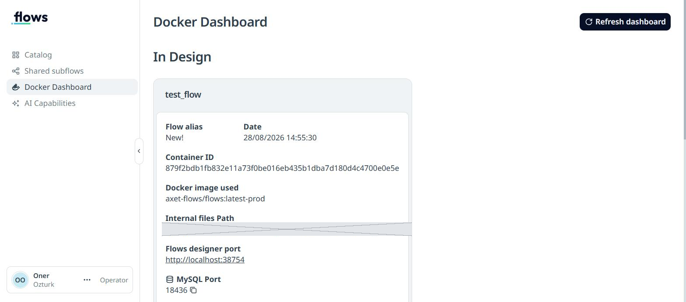
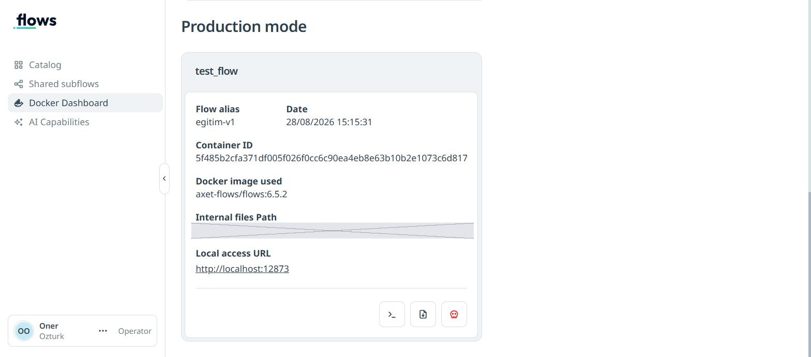

# 6. Versiyon ve Canlıya Alma

Şimdiye kadar her şeyi **tasarımcıda** yaptık. Bu ders, akışı gerçek bir iş
gibi çalıştırmayı anlatıyor: versiyon kaydetme ve **Production mode**.

## 6.1 Neden gerekli? (Acı bir ders)

Bu eğitimi hazırlarken şu oldu: makine kapandı, ertesi gün tasarımcı boş
açıldı. **Beş dersin akışı gitmişti.**

Sebep: akışlar tasarımcı konteynerinin içinde yaşar. Konteyner silinince
gider. Docker imajları diskte kalır ama içerik kaybolur.

Portalın kendi uyarısı bunu açıkça söylüyor:

> *Remember that in the case of not executing the action 'Save in cloud!'
> you will lose any creation/modification of the designed flows inside the
> container!*

**Üç saklama katmanı vardır:**

| Katman | Nerede | Ne zaman kaybolur |
|---|---|---|
| Tarayıcı taslağı | Editör belleği | Deploy etmeden sekmeyi kapatınca |
| Konteyner içi akış | Designer konteyneri | Konteyner silinince |
| **Versiyon** | **Portal (bulut)** | **Silmedikçe kaybolmaz** |

Versiyon kaydetmek, işinizi ilk iki katmandan kurtarır.

## 6.2 Versiyon kaydetme

Tasarımcıda, alt ortadaki araç çubuğunda **bulut+ok** simgesine tıklayın.

`Create new version of this Flows` penceresi açılır:

| Alan | Açıklama |
|---|---|
| **Version alias*** | Zorunlu. Versiyon adı (ör. `egitim-v1`) |
| Run Sonnar after save? | Kaydettikten sonra kod kalite analizi (SonarQube) çalıştırır |
| Description message | Değişiklik notu — ileride ne olduğunu hatırlatır |

> ⚠️ **Kritik uyarı:** *"The changes to be stored in the cloud correspond to
> the last deploy made."*
>
> Kaydedilen şey **tuvaldeki taslak değil, son deploy edilmiş haldir.**
> Versiyon almadan önce mutlaka **Deploy** edin.

**Save** dedikten sonra Catalog → flow → versiyon listesinde satır belirir:

| Alias | Description | Created date | Version | Analysis |
|---|---|---|---|---|
| `egitim-v1` | Egitim akislari... | 28/08/2026 | **6.5.2** | (Sonnar sonucu) |

`Version` sütunundaki `6.5.2`, akışın çalışacağı **platform sürümüdür**.

## 6.3 Versiyon menüsü

Versiyon satırındaki `…` menüsünde dört seçenek var:

| Seçenek | Ne yapar |
|---|---|
| **Run Flow** | Versiyonu **yerel makinede** Production mode'da çalıştırır |
| **Deploy** | Versiyonu **buluta** dağıtır (Cloud Deployments listesine düşer) |
| **Export Flow** | JSON olarak indirir — yedekleme/paylaşım |
| Delete Flow Version | Versiyonu siler |

## 6.4 Production mode'da çalıştırma

**Run Flow** → **Regular Deployment** seçin.

Platform, versiyona ait Docker imajını indirir (ilk seferde birkaç dakika) ve
**ikinci bir konteyner** başlatır. Artık iki ortam yan yana çalışır:

```powershell
wsl.exe -d aXet-flows_WSL -- docker ps --format "{{.Names}} | {{.Ports}}"
```

```
deptapps-flows-designer-container-...  | 172.17.0.1:38754->1880/tcp   <- tasarim
deptapps-flows-runner-container-...    | 172.17.0.1:12873->1880/tcp   <- canli
```

> Arada kısa süre `falcon-patch-...` adında bir konteyner görebilirsiniz.
> Bu CrowdStrike güvenlik ajanının yama konteyneridir, geçicidir.

### İki ortamın farkı

**In Design:**



**Production mode:**



| | In Design | Production mode |
|---|---|---|
| Flow alias | `New!` | **Versiyon adı** (`egitim-v1`) |
| Docker image | `axet-flows/flows:latest-prod` | **`axet-flows/flows:6.5.2`** |
| Erişim | *Flows designer port* → editör | *Local access URL* → sadece çalışma |
| Dosya klasörü | `.deptapps-instances-in-designer-mode\<no>` | `.deptapps-instances\<no>` |

İki önemli sonuç:

1. **Production sürüme kilitlenir.** Tasarımcı `latest-prod` kullanır ve
   platform güncellenince değişir; canlı ortam ise `6.5.2`'de sabit kalır.
   Bu, "dün çalışıyordu bugün bozuldu" sorununu önler.
2. **Dosya klasörleri ayrıdır.** Test verisi canlı veriyi kirletmez.

## 6.5 En önemli fark: editör kapalıdır

Production konteynerinin adresine gitmeyi deneyin:

```powershell
Invoke-WebRequest http://127.0.0.1:<production-port> -SkipHttpErrorCheck |
  Select-Object StatusCode
```

**404** döner. Konteyner loglarında sebebi yazar:

```
Admin UI disabled
Starting flows
Started flows
Registered AUTOMATISM_STARTUP_CLOUD as platform value in Flows Audit
```

Yani: **akışlar çalışıyor ama kimse tuvali açıp değiştiremiyor.** `/flows`,
`/settings` gibi tüm yönetim uçları kapalıdır.

Bu bilinçli bir tasarımdır. Canlı ortamda kimse "hızlıca şunu düzelteyim"
diyemez; değişiklik tasarımcıda yapılır, yeni versiyon kaydedilir, yeniden
dağıtılır. Kurumsal otomasyonda izlenebilirliğin temeli budur.

## 6.6 Canlıda çalıştığını kanıtlama

Ders 4'ün zamanlayıcılı akışını canlıya aldıysanız, **tarayıcıyı tamamen
kapatın** ve dosyayı Windows'tan izleyin:

```powershell
$p = "$env:LOCALAPPDATA\axet-flows\.deptapps-instances"
Get-ChildItem $p -Recurse -Filter 'akis-raporu.txt' | Get-Content -Tail 5
```

Satırlar artmaya devam ediyorsa akış gerçekten canlıda çalışıyor demektir —
tasarımcıdan, tarayıcıdan ve sizden bağımsız.

```
28.08.2026 15:16:11 | calisma #1 | durum: OK
28.08.2026 15:16:31 | calisma #2 | durum: OK
28.08.2026 15:16:51 | calisma #3 | durum: OK
```

## 6.7 Production'ı durdurma

Docker Dashboard → **Production mode** kartı → **kırmızı kafatası** simgesi.

Onay penceresi çıkar (`Kill instance`). **Confirm** deyin.

Doğrulama: dosya satır sayısı artmayı durdurmalı, `docker ps` çıktısında
sadece designer konteyneri kalmalı.

> ⚠️ **Zamanlanmış akışları canlıya alırken dikkatli olun.** Unutulmuş bir
> zamanlayıcı günlerce dosya şişirir veya bir API'yi gereksiz yorar.
> Canlıya almadan önce `inject` düğümünün Repeat ayarını gözden geçirin.

## 6.8 Cloud Deployments

**Deploy** seçeneği akışı buluta dağıtır; sonuç Catalog → flow sayfasındaki
**Cloud Deployments** tablosunda görünür (Date / Alias / URL).

Bulut dağıtımı, akışı makinenizden bağımsız çalıştırır — makineniz kapalıyken
de işler. Bunun için projenizin bulut kotasına ihtiyaç vardır; yoksa proje
sahibinden talep edin.

## 6.9 Doğru çalışma düzeni

```
1. Tasarımcıda geliştir       (In Design)
2. Deploy et ve test et       (alt ortadaki ▷)
3. Versiyon kaydet            (bulut+ok simgesi)   <- ADIM ATLAMAYIN
4. Run Flow / Deploy          (versiyon menüsü)
5. İşin bitince kilidi bırak  (Catalog -> Unblock Flow)
```

3. adımı atlarsanız işiniz konteynerle birlikte kaybolur. Bu eğitimi
hazırlarken tam olarak bu oldu.

## 6.10 Alıştırmalar

1. **Kolay** — Bir akışta küçük bir değişiklik yapın, deploy edin ve
   `egitim-v2` adıyla ikinci bir versiyon kaydedin. Versiyon listesinde iki
   satır görüyor musunuz?
2. **Orta** — `egitim-v1`'i **Export Flow** ile indirin. İndirdiğiniz JSON'u
   bir metin düzenleyicide açın; hangi bilgileri içeriyor?
3. **Zor** — Ders 4'ün zamanlayıcısını 60 saniyeye çıkarıp yeni versiyon
   kaydedin, canlıya alın. Sonra **eski** versiyonu (`egitim-v1`) çalıştırın.
   Hangi dosyaya, hangi aralıkla yazıyor? Versiyonların birbirinden bağımsız
   olduğunu gözleyin.

---

**Takıldınız mı?** → [Sorun Giderme](SORUN-GIDERME.md)
