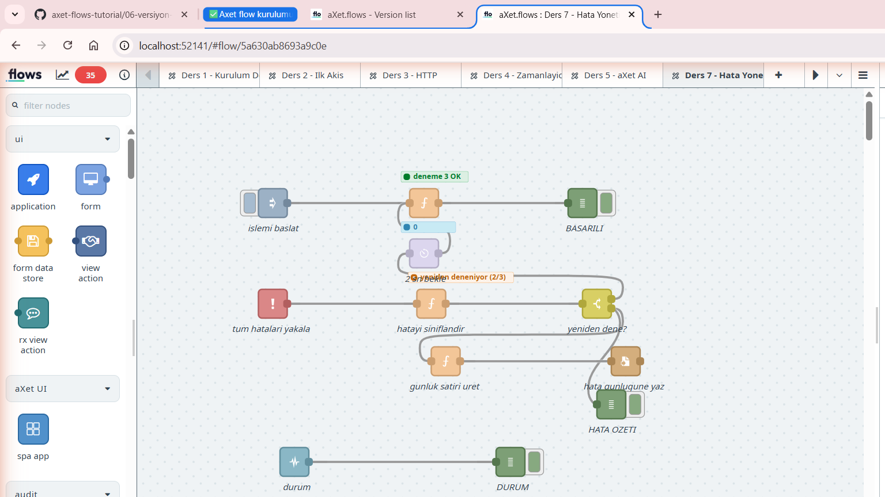

# 7. Hata Yönetimi ve Dayanıklılık

Ders 6'da akışı **Production mode**'a aldık. Orada bir şey değişti:
**editör kapalıdır, debug panelini göremezsiniz.**

Soru şu: akış gece 03:00'te patlarsa ne olacak? Bunu kim görecek?

Bu ders, akışa üç yetenek ekler:

1. Hatayı **yakalama** (`catch`)
2. Geçici hatayı **yeniden deneme** (retry)
3. Hatanın **kalıcı izini bırakma** (dosya günlüğü)

> Bu ders yeni bir platform ekranı açmaz; tamamı tasarımcı tuvalinde geçer.
> Kullanılan düğümler (`catch`, `status`, `delay`) standart palettedir —
> paletinizde göremezseniz arama kutusuna adını yazın.

## 7.1 Varsayılan davranış: sessiz ölüm

Bir düğüm hata verdiğinde ne olur?

| Ortam | Ne görürsünüz |
|---|---|
| Tasarımcı | Debug panelinde kırmızı satır, düğümün altında rozet |
| **Production** | **Hiçbir şey.** Mesaj sessizce düşer |

Akış durmaz, çöktüğünü de söylemez. O tetikleme yok olur. Bir sonraki
tetikleme gelir, o da düşer. Haftalarca böyle gidebilir.

**Hatayı yakalamak, akışın kendi işi olmalı.** Kimse log dosyasına bakmayacak.

## 7.2 İki farklı "hata" vardır

Bunları karıştırmak, bu konudaki en yaygın kafa karışıklığıdır.

### a) Hata çıkışı olan düğümler

Ders 5'teki AI ajanı gibi bazı düğümlerin **ikinci bir çıkışı** vardır.
Hata oraya gider — normal bir mesaj gibi, kendi dalınızda işlersiniz.
Bunun için `catch`'e gerek yoktur.

### b) Fırlatılan hatalar

`function` içinde `throw`, `http request`'te bağlantı reddi, `file`
düğümünde yazma izni yok... Bunların hata çıkışı yoktur. Mesaj düşer.

**`catch` düğümü ikinci grubu yakalar.**

## 7.3 `catch` — akış çapında güvenlik ağı

Palette'ten `catch` düğümünü tuvale bırakın. Ayarı tek satırdır:

| Ayar | Anlamı |
|---|---|
| **Catch errors from: all nodes** | Sekmedeki her düğümü dinler (önerilen başlangıç) |
| Catch errors from: selected nodes | Sadece seçtiğiniz düğümleri dinler |
| ☐ Ignore errors handled by other Catch nodes | İşaretliyse, başka `catch` yakaladıysa bu susar |

> `catch` düğümünün **girişi yoktur** — hiçbir şeye bağlamazsınız.
> Kendisi dinler. Siz sadece çıkışını bağlarsınız.

Bir sekmede hem genel (`all nodes`) hem özel (`selected nodes`) `catch`
kullanmak yaygındır: özel olan kritik düğümü ayrı işler, genel olan geri
kalan her şeyi toplar.

## 7.4 `msg.error` sözleşmesi

`catch` yakaladığı mesajı **olduğu gibi** aktarır ve içine `msg.error`
ekler. Yani `msg.payload`, `msg.topic` ve kendi eklediğiniz alanlar
**kaybolmaz** — yeniden deneme sayacını taşıyabilmemizin sebebi budur.

| Alan | İçerik |
|---|---|
| `msg.error.message` | Hata metni |
| `msg.error.source.id` | Hatayı üreten düğümün ID'si |
| `msg.error.source.type` | Düğüm tipi (`function`, `http request`, `file`…) |
| `msg.error.source.name` | Düğümün adı |

`source.name` sayesinde "hangi düğüm patladı" sorusunun cevabı günlüğe
yazılabilir. Bu yüzden **düğümlerinize isim verin** — isimsiz düğüm
günlükte yalnızca `function` olarak görünür, hangisi olduğu belli olmaz.

## 7.5 `function` içinden hata fırlatmanın üç yolu

Aradaki fark küçük görünür ama sonuç tamamen değişir:

| Yazım | Akış durur mu | `catch` yakalar mı |
|---|---|---|
| `node.warn("metin")` | Hayır | Hayır — sadece uyarı |
| `node.error("metin")` | Hayır | **Hayır** ⚠️ |
| `node.error("metin", msg)` | Evet (`return null` ile) | **Evet** |
| `throw new Error("metin")` | Evet | Evet |

> ⚠️ **En sık yapılan hata:** `node.error("metin")` yazıp ikinci
> parametreyi unutmak. Hata log'a düşer, `catch` dalınız hiç çalışmaz,
> siz de "catch bozuk" diye saatlerce ararsınız.
>
> Kural: **`catch`'in görmesini istiyorsanız `msg`'yi ikinci parametre
> olarak verin.**

`throw` ile `node.error(metin, msg)` arasındaki tercih: `throw` ani kesme
içindir (beklenmedik durum), `node.error(…, msg)` ise kontrollü bir
"bu iş olmadı" bildirimidir. Eğitim akışında ikincisini kullanıyoruz.

## 7.6 Yeniden deneme (retry) döngüsü

Servis üç saniye kapalı kaldıysa akışın tümden vazgeçmesi gereksizdir.
Kurulum şu şekilde:

```
inject -> riskli islem -> (basarili) -> debug
             |
          (hata firlar)
             v
  catch -> siniflandir -> switch -+-> "yeniden-dene" -> delay 2sn --+
                                  |                                 |
                                  +-> "vazgec" -> gunluk -> file    |
                                                                    |
        (delay cikisi riskli isleme GERI baglanir) <----------------+
```

Üç kural, bu döngüyü sonsuz döngü olmaktan kurtarır:

**1. Sayacı `msg` üzerinde taşıyın, context'te değil.**

```javascript
msg.deneme = (msg.deneme || 0) + 1;
```

`flow.set("deneme", …)` kullanırsanız, aynı anda gelen iki tetikleme aynı
sayacı paylaşır ve birbirinin deneme hakkını tüketir. `msg` üzerindeki
sayaç her tetiklemeye özeldir. (Ders 4'teki `flow` context'i **kalıcı
toplam** içindi — amaç farklıydı.)

**2. Üst sınır koyun.**

```javascript
const ENUST_DENEME = 3;
if (geciciMi && deneme < ENUST_DENEME) { ... }
```

Sınırsız retry, kapalı bir servise saldırıya dönüşür.

**3. Sadece geçici hataları yeniden deneyin.**

| Hata türü | Örnek | Yeniden dene? |
|---|---|---|
| Geçici | timeout, 503, bağlantı reddi, 429 | ✅ Evet |
| Kalıcı | 401 yetkisiz, 404, geçersiz JSON, kota bitti | ❌ Hayır |

Ders 5'teki `Budget exhausted` hatası kalıcıdır — 100 kez denemek de
çözmez. Sınıflandırma kodu bunu hata metninden ayırt eder:

```javascript
const geciciMi = /timeout|ECONNREFUSED|yanit vermedi|503|502|429/i.test(metin);
```

> **`delay` düğümü neden gerekli?** `function` içinde `setTimeout` ile
> beklemeye çalışmayın — sandbox davranışı ve akış ölçümü açısından
> güvenilir değildir. Bekleme, `delay` düğümünün işidir.

## 7.7 `status` — düğüm rozetlerini izlemek

Düğümlerin altındaki küçük renkli rozet (`node.status({…})`) sadece
görseldir; **akışa mesaj göndermez.** Production'da onu kimse görmez.

`status` düğümü bu rozet değişimlerini **mesaja çevirir**:

```javascript
node.status({ fill: "red", shape: "ring", text: "deneme 1 basarisiz" });
```

`status` düğümünün çıkışında:

| Alan | Değer |
|---|---|
| `msg.status.text` | `deneme 1 basarisiz` |
| `msg.status.source.id` | Rozeti gösteren düğümün ID'si |

Böylece "üçüncü denemede geçti" bilgisi de günlüğe yazılabilir hale gelir.

| Düğüm | Neyi dinler |
|---|---|
| `catch` | Hataları |
| `status` | Durum rozeti değişikliklerini |

## 7.8 Kalıcı iz: hata günlüğü

Ders 4'teki `file` düğümü burada gerçek işine kavuşuyor:

| Ayar | Değer |
|---|---|
| Filename | `/data/hata-gunlugu.log` |
| Action | Append to file |
| ☑ Add newline to each payload | İşaretli |
| ☑ Create directory if it doesn't exist | İşaretli |

Üretilen satır, sonradan `grep` ya da Excel ile okunabilecek biçimde:

```
29.08.2026 12:00:35 | GECICI | deneme=3 | dugum=riskli islem | mesaj=Servis yanit vermedi (deneme 3)
```

> **`/data` yolu kritik.** Ders 4'te öğrendiğimiz gibi konteyner içindeki
> başka bir dizine yazarsanız konteyner silindiğinde günlük de gider —
> tam da en çok ihtiyaç duyacağınız anda.

## 7.9 Çalıştırma ve beklenen sonuç

**Deploy** edin, `islemi baslat` düğümünün butonuna basın.



> ⚠️ **Sağ paneldeki iki sekmeyi karıştırmayın.** `debugger` sekmesi (adım
> adım hata ayıklayıcı) ile `debug` sekmesi (mesaj listesi) ayrı şeylerdir.
> Mesajları görmek için **böcek ikonuna** tıklayın — `debugger` sekmesini
> açıp "mesaj gelmiyor" sanmak kolaydır.

Debug panelinde sırayla şunları görmelisiniz:

| Sıra | Görünen | Açıklama |
|---|---|---|
| 1 | `DURUM: deneme 1 basarisiz` | İlk deneme patladı |
| 2 | (2 saniye sessizlik) | Geçici hata → yeniden deneme kararı |
| 3 | `DURUM: deneme 2 basarisiz` | İkinci deneme de patladı |
| 4 | `DURUM: deneme 3 OK` | Üçüncüde geçti |
| 5 | `BASARILI: {sonuc: "islem tamamlandi", kacinciDenemede: 3}` | Akış tamamlandı |

Toplam süre yaklaşık 4 saniyedir (iki kez 2 saniye bekleme).

**Vazgeçme dalını görmek için:** `riskli islem` içindeki
`gecmesiGerekenDeneme` değerini `9` yapın. Artık üç deneme yetmeyecek,
`vazgec` dalı çalışacak ve `/data/hata-gunlugu.log` dosyasına satır düşecek.

Dosyanın gerçekten yazıldığını konteyner içinden de doğrulayabilirsiniz:

```powershell
wsl.exe -d aXet-flows_WSL -- docker exec $(wsl.exe -d aXet-flows_WSL -- docker ps -q) cat /data/hata-gunlugu.log
```

## 7.10 Sık karşılaşılan hatalar

### `catch` dalı hiç çalışmıyor

Üç ihtimal, sırayla kontrol edin:

1. `node.error("metin")` yazılmış, `msg` parametresi unutulmuş (bkz. 7.5)
2. `catch` düğümü **başka bir sekmede** — `catch` sadece kendi sekmesini dinler
3. Hata, **hata çıkışı olan** bir düğümden geliyor (bkz. 7.2a) — o zaten
   ikinci çıkışa gitmiştir, `catch`'e düşmez

### Sonsuz döngü — akış durmuyor

Üst sınır kontrolü ya yoktur ya da sayaç `msg` yerine context'te tutulup
her seferinde sıfırlanıyordur. `deneme` değerini debug'da yazdırıp
gerçekten arttığını doğrulayın.

Akış zaten döngüye girdiyse: düğümü **disable** edip Deploy edin, döngü kırılır.

### Günlük dosyası boş

- `Action` alanı `Append to file` yerine `Overwrite file` seçilmiş olabilir —
  her satır bir öncekini siler
- `msg.payload` bir **nesne** olabilir; `file` düğümü metin bekler (bkz. Ders 4)

### `catch` kendi hatasını yakalıyor (döngü)

`catch` dalındaki bir düğüm hata verirse, aynı `catch` onu tekrar yakalar.
Sınıflandırma kodunu basit ve hatasız tutun; içinde riskli çağrı yapmayın.

## 7.11 Hazır akışı import etmek

1. **☰ menü → Import**
2. [`kaynaklar/ornek-07-hata-yonetimi.json`](kaynaklar/ornek-07-hata-yonetimi.json)
   içeriğini yapıştırın
3. **Import** → **Deploy**

Function kodları ayrı ayrı da okunabilir:

- [`ders07-riskli-islem.js`](kaynaklar/ders07-riskli-islem.js)
- [`ders07-hata-siniflandir.js`](kaynaklar/ders07-hata-siniflandir.js)
- [`ders07-gunluk-satiri.js`](kaynaklar/ders07-gunluk-satiri.js)

## 7.12 Alıştırmalar

1. **Kalıcı hatayı ayırt edin.** `riskli islem` düğümündeki hata metnini
   `Yetkisiz erisim (401)` yapın. Sınıflandırma bunu kalıcı sayacağı için
   yeniden deneme olmadan doğrudan günlüğe düşmeli. Doğrulayın.

2. **Artan bekleme (exponential backoff).** Şu an her denemede 2 saniye
   bekleniyor. `delay` düğümünü bekleme süresini `msg.delay` alanından
   okuyacak şekilde ayarlayın (*Override delay with msg.delay*) ve
   sınıflandırma koduna `msg.delay = 1000 * Math.pow(2, deneme);` satırını
   ekleyin. Bekleme 2 → 4 → 8 saniye olmalı.

3. **Ders 3 ile birleştirin.** Ders 3'teki `http request` düğümünün URL'sini
   var olmayan bir adrese çevirin (`https://ornek-yok.invalid`). Bu derste
   kurduğunuz `catch` dalının o hatayı da yakaladığını görün — tek güvenlik
   ağı tüm sekmeyi korur.

4. **Production'da doğrulayın.** Akışı versiyonlayıp (Ders 6) Production
   mode'da çalıştırın. Editör kapalıyken hatanın tek kanıtı
   `/data/hata-gunlugu.log` dosyasıdır — dosyayı okuyup satırların
   düştüğünü gösterin.

---

**Önceki:** [6. Versiyon ve Canlıya Alma](06-versiyon-ve-canliya-alma.md) ·
**Başvuru:** [Sorun Giderme](SORUN-GIDERME.md)
