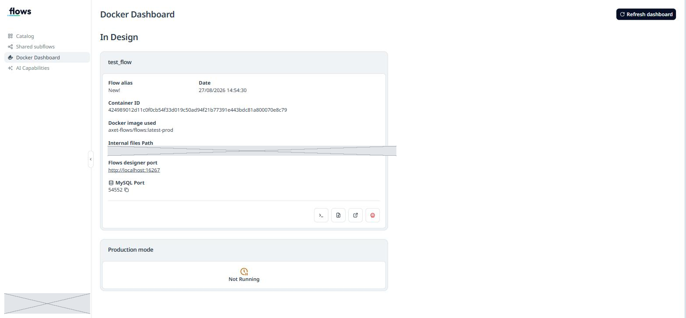

# Sorun Giderme

Kurulum ve ilk kullanımda karşılaşılan hatalar, sebepleri ve çözümleri.
Hepsi gerçek bir kurulumda yaşandı.

## Hızlı teşhis komutu

Bir şey çalışmıyorsa önce bunu çalıştırın — zincirin hangi halkasının
koptuğunu gösterir:

```powershell
Write-Host "1. Masaustu ajani:" -NoNewline
if (Get-Process 'aXet.flows-Desktop' -ErrorAction SilentlyContinue) { " CALISIYOR" } else { " KAPALI" }

Write-Host "2. WSL dagitimi:"
wsl.exe -l -v

Write-Host "3. Docker:"
wsl.exe -d aXet-flows_WSL -- docker version --format '{{.Server.Version}}'

Write-Host "4. Yerel ajan (401 = normal):"
(Invoke-WebRequest 'https://localhost:65430/api/health' -SkipCertificateCheck -SkipHttpErrorCheck).StatusCode

Write-Host "5. SSH proxy:"
netstat -ano | Select-String ':2222'

Write-Host "6. Konteynerler:"
wsl.exe -d aXet-flows_WSL -- docker ps
```

---

## Kurulum sorunları

### "Starting SSH proxy for mirrored networking mode..." ekranında takıldı

**Belirti:** aXet.flows Desktop açılış ekranında bu mesajla donuyor,
dakikalarca (bizde yarım saat) ilerlemiyor.

**Sebep:** SSH proxy adımı, WSL dağıtımının ilk kurulumuyla yarışıyor.
Altyapı aslında hazır oluyor ama uygulama sinyali kaçırıyor.

**Kontrol:** Gerçekten hazır mı?

```powershell
netstat -ano | Select-String ':2222'          # ESTABLISHED satiri var mi?
(Invoke-WebRequest 'http://127.0.0.1:2375/version' -UseBasicParsing).StatusCode   # 200 mu?
```

İkisi de olumluysa altyapı hazır, sadece uygulama takılmış.

**Çözüm:** Uygulamayı kapatıp yeniden açın.

```powershell
Stop-Process -Name 'aXet.flows-Desktop' -Force -ErrorAction SilentlyContinue
Stop-Process -Name 'win-sshproxy' -Force -ErrorAction SilentlyContinue
Start-Sleep -Seconds 4
Start-Process 'C:\ProgramData\NTT\axetflows-desktop\axetflows-desktop-win-prod\aXet.flows-Desktop.exe'
```

---

### "Internal server error — Docker container connection error"

**Tam metin:**
> Internal server error
> Docker container connection error. Please ensure that the container runtime is running.

**Nerede:** Portalda, genellikle Docker Dashboard'a girerken.

**Sebep:** Portal, yerel makinenizdeki Docker'a ulaşamıyor. Portal sadece
arayüzdür; konteyner sizin makinenizde çalışır.

**Çözüm sırası:**

1. aXet.flows Desktop çalışıyor mu? → Başlat Menüsü'nden açın
2. WSL dağıtımı ayakta mı? → `wsl.exe -l -v` → `Running` olmalı
3. Docker cevap veriyor mu? → `wsl.exe -d aXet-flows_WSL -- docker ps`
4. Hâlâ olmuyorsa → uygulamayı kapat-aç

---

### "Error trying to open the axet flow designer!"

**Belirti:** New Version → Regular Deployment sonrası bu hata.

**Sebep (en yaygın):** Docker hazır değil veya imaj henüz inmemiş.

**Kontrol:**

```powershell
wsl.exe -d aXet-flows_WSL -- docker images
```

`axet-flows/flows:latest-prod` (yaklaşık 2.18 GB) listede olmalı.
Yoksa imaj inmemiştir.

**Çözüm:** Docker'ın ayakta olduğundan emin olup **New Version** işlemini
tekrarlayın. İlk indirme 5-15 dakika sürer, sabırlı olun — portaldaki
ilerleme çubuğunu izleyin.

---

### Company Portal'da / Programlar listesinde aXet.flows yok

**Bu normaldir.** aXet.flows Desktop klasik MSI kurulumu değildir,
`C:\ProgramData\NTT\axetflows-desktop\` altına dağıtılır. Kontrol:

```powershell
Test-Path 'C:\ProgramData\NTT\axetflows-desktop\axetflows-desktop-win-prod\aXet.flows-Desktop.exe'
```

Kaldırmak için klasörü silmek gerekir; kaldırma sihirbazı yoktur.

---

### "Docker Desktop kurmam gerekiyor mu?"

**Hayır.** Uygulama kendi WSL dağıtımını kurar ve Docker'ı içinde çalıştırır.
Docker Desktop kurmayın — çakışma yaratabilir.

WSL platformu zaten etkinse (`wsl.exe --version` çalışıyorsa) **yönetici
hakkı olmadan** tüm kurulum tamamlanır. Yönetici hakkı sadece WSL'in
kendisi hiç kurulu değilse gerekir.

---

## Tasarımcı sorunları

### Düğüm tuvalde bağlı görünüyor ama akış çalışmıyor

**Belirti:** `A → B → C` şeklinde dizilmiş düğümler, ama ortadaki düğüm
hiç çalışmıyor. Hata mesajı yok.

**Sebep:** Düğümü mevcut bir kablonun *üzerine* bıraktınız ve Node-RED'in
"araya gir" davranışı tetiklenmedi. Kablo düğümün üzerinden geçiyor gibi
görünüyor ama bağlantı hâlâ eski haliyle duruyor.

**Kontrol (kesin yöntem):**

```powershell
Invoke-RestMethod -Uri 'http://127.0.0.1:<PORT>/flows' |
  Where-Object { $_.type -in 'inject','function','debug' } |
  Select-Object type, name, wires
```

Ortadaki düğümün `wires` alanı `[[]]` ise bağlantısızdır.

**Çözüm:** Eski kabloyu silin (üzerine tıkla → Delete), kabloları elle
çizin.

---

### "Warning: node has undeployed changes"

**Sebep:** Değişikliği deploy etmediniz. Tuvaldeki her şey taslaktır.

**Çözüm:** **Alt ortadaki ▷** butonuna basın. (Sağ üstteki benzer buton
değil.)

---

### function düğümü çalışıyor ama sonraki düğüme bir şey gitmiyor

**Sebep:** Kodun sonunda `return msg;` yok.

`function` düğümü, döndürdüğünüz mesajı çıkışına verir. Döndürmezseniz
mesaj orada ölür ve **hata da vermez**.

**Çözüm:** Kodun sonuna `return msg;` ekleyin.

---

### Debug panelinde hiçbir şey görünmüyor

Sırayla kontrol edin:

1. Debug paneli açık mı? → Sağ üstteki 🐞 simgesi → *Debug messages*
2. Akış deploy edildi mi? → Alt ortadaki ▷
3. `debug` düğümü etkin mi? → Düğümün sağındaki küçük kare butona bakın
4. Bağlantılar doğru mu? → Yukarıdaki `wires` kontrolü

---

### Flow'u başkası düzenleyemiyor / "flow is blocked"

**Sebep:** Biri **New Version** yaptı ve kilidi bırakmadı.

**Çözüm:** Kilidi alan kişi: **Catalog** → flow kartının `…` menüsü →
**Unblock Flow**.

Kartta asma kilit simgesi ve kilidi tutan kişinin adı görünür.

---

## Tasarımcı portunu bulma

Tasarımcı konteyneri her açılışta **farklı bir port** kullanır.

**En kolay yol — portaldan:** **Docker Dashboard** → *In Design* kutusu →
**"Flows designer port"** satırı adresi doğrudan verir.



**Komut satırından:**

```powershell
wsl.exe -d aXet-flows_WSL -- docker ps --format "{{.Names}} {{.Ports}}"
```

Çıktıda `172.17.0.1:<PORT>->1880/tcp` görürsünüz. Tasarımcı adresi:
`http://127.0.0.1:<PORT>`

---

## HTTP ve veri sorunları

### `msg.payload.<alan>` undefined geliyor / switch hiçbir dala girmiyor

**Belirti:** `http request` düğümü veri getiriyor, debug'da JSON gibi
görünüyor, ama `payload.completed` gibi bir alana erişemiyorsunuz. `switch`
düğümü de hiçbir mesaj geçirmiyor.

**Sebep:** `http request` düğümünün **Return** ayarı "a UTF-8 string".
Yanıt metin olarak geliyor, nesne olarak değil.

**Kontrol:** Debug panelindeki tip etiketine bakın:

```
msg.payload : string[83]     <-- METIN (yanlis)
msg.payload : Object         <-- NESNE (dogru)
```

**Çözüm:** `http request` düğümü → **Return** → **"a parsed JSON object"**.

> Debug panelindeki tip etiketi, gözünüzle okuduğunuz içerikten daha
> güvenilir bilgidir.

---

### `403 Forbidden` veya `504 Gateway Time-out`

**Sebep:** Kurumsal proxy/güvenlik duvarı konteynerin dış erişimini engelliyor.

**Kontrol:** Konteynerden doğrudan test edin:

```powershell
$k = wsl.exe -d aXet-flows_WSL -- docker ps --format "{{.Names}}"
wsl.exe -d aXet-flows_WSL -- docker exec $k curl -s -o /dev/null -w "%{http_code}" https://jsonplaceholder.typicode.com/todos/1
```

`200` → erişim var, sorun akışta. `000`/`403`/`504` → ağ engeli.

**Çözüm:** `http request` düğümünde **"Use proxy"** seçeneğini işaretleyip
kurumunuzun proxy adresini girin. Adresi bilmiyorsanız IT'den isteyin.

---

### switch düğümü kuruldu ama mesaj kayboluyor

**Sebep:** Hiçbir kural eşleşmedi. Node-RED bu durumda mesajı **sessizce
düşürür** — hata vermez.

**Çözüm:** Son kural olarak `otherwise` ekleyip bir debug'a bağlayın.
Beklenmedik veriyi böyle yakalarsınız.

---

### `ReferenceError: process is not defined` (veya require/fs)

**Sebep:** `function` düğümü izole bir güvenlik sandbox'ında çalışır.
`process`, `require`, `fs` gibi Node.js iç yapıları **bilerek kapatılmıştır** —
akış yazan kişi sunucunun dosya sistemine keyfi erişemesin diye.

**Çözüm:** İzin verilen yolları kullanın:

| İhtiyaç | Yasak | İzinli |
|---|---|---|
| Ortam değişkeni | `process.env.X` | `env.get("X")` |
| Dosya okuma/yazma | `fs.writeFile` | `file` / `file in` düğümleri |
| HTTP isteği | `require('axios')` | `http request` düğümü |
| Zaman | — | `new Date()` serbest |

> Kural: **function düğümü veriyi dönüştürür, dış dünyaya erişmez.**
> Dış dünya işleri için o işe özel düğümler vardır.

---

### function düğümünden sonraki düğüme bir şey gitmiyor

Kodun sonunda `return msg;` var mı? Yoksa mesaj o düğümde ölür ve **hata
vermez**. (Ders 2 ve 3'te aynı tuzak.)

---

## Dosya sorunları

### Akış dosya yazdı ama Windows'ta bulamıyorum

**Sebep:** Yanlış klasöre yazdınız. Konteynerin her klasörü Windows'la
paylaşılmaz.

**Kontrol — eşleşmeleri listeleyin:**

```powershell
$k = wsl.exe -d aXet-flows_WSL -- docker ps --format "{{.Names}}"
wsl.exe -d aXet-flows_WSL -- docker inspect $k --format '{{range .Mounts}}{{.Source}} -> {{.Destination}}{{"`n"}}{{end}}'
```

| Konteyner içi | Windows'ta görünür mü |
|---|---|
| `/internal-storage-files/files/` | ✅ Evet |
| `/external-repository-files/` | ✅ Evet |
| `/data` | ❌ Docker volume |
| `/tmp`, `/home`, diğerleri | ❌ Konteyner ölünce kaybolur |

**Çözüm:** `file` düğümünde tam yol olarak
`/internal-storage-files/files/dosya.txt` kullanın.

**Windows'tan bulmak için:**

```powershell
Get-ChildItem "$env:LOCALAPPDATAxet-flows" -Recurse -Filter '*.txt' | Select-Object FullName, LastWriteTime
```

---

### Dosyada sadece son satır var / her seferinde siliniyor

`file` düğümünün **Action** ayarı "Overwrite file" olarak seçilmiş.
Birikmesini istiyorsanız **"Append to file"** yapın.

---

### Dosyaya `[object Object]` yazılıyor

`file` düğümü `msg.payload` içindeki **metni** yazar. Nesne verirseniz bunu
görürsünüz.

**Çözüm:** `function` düğümünde payload'ı metne çevirin:

```javascript
msg.payload = `${alan1} | ${alan2}`;        // metin
// veya JSON olarak yazmak isterseniz:
msg.payload = JSON.stringify(msg.payload);
```

---

### Zamanlanmış akış durmuyor

**Belirti:** `inject` düğümüne Repeat verdiniz, akış durmadan çalışıyor,
dosya şişiyor.

**Çözüm:** `inject` düğümü → **Repeat: none** → Done → **Deploy**.

Doğrulama: 30 saniye bekleyip dosyanın büyümediğini kontrol edin.

> Unutulmuş zamanlayıcı, günlerce dosya şişirir veya bir API'yi gereksiz
> yere yorar. Test bitince kapatmayı alışkanlık haline getirin.

---

### Sayaç her çalışmada 1'de kalıyor

`function` içinde normal değişken kullanmışsınız — her mesajda sıfırlanır.

**Çözüm:** context kullanın:

```javascript
let sayac = flow.get("sayac") || 0;
sayac = sayac + 1;
flow.set("sayac", sayac);
```

> Context bellekte tutulur; konteyner yeniden başlarsa sıfırlanır.
> Kalıcı olması gerekiyorsa dosyaya yazın.

---

## AI ajanı sorunları

### `Project ID not configured` (VALIDATION_ERROR)

Ajan düğümünde proje seçilmemiş. Düğümü açıp **Project** seçin.

**Dikkat:** Bu düğümde açılır menüleri **fareyle** seçin. Klavyeyle (ok
tuşları + Enter) yapılan seçim ekranda görünür ama kaydedilmez —
`projectId` boş kalır. Kontrol için düğümü kapatıp tekrar açın.

---

### `Budget exhausted or billing disabled for this project`

**Kod hatası değil, bütçe/yetki sorunudur.** Seçili projenin AI kredisi kapalı.

**Çözüm:** Başka bir proje deneyin (birden fazla projeye erişiminiz olabilir).
Hepsi kapalıysa proje sahibinden veya IT'den AI bütçesi isteyin.

Hata zinciri mimariyi gösterir:

```
Mastra API error 500  ->  litellm.APIError  ->  OpenAIException
   (ajan katmani)          (model yonlendirici)     (saglayici)
```

---

### Palette iki farklı ajan düğümü var, hangisi?

| Düğüm | Kategori | Kullan |
|---|---|---|
| `Flows AI Agent` (`axet-agents-execute`) | **aXet AI** | ✅ Evet |
| `aXet Agent` | **Deprecated nodes** | ❌ Hayır |

---

### AI yanıtına erişemiyorum

Yanıt nesne olarak gelir, metin `response` anahtarındadır:

```javascript
const metin = msg.payload.response;
```

---

### Model kurum içi bilgiyi bilmiyor

Beklenen davranış — genel dil modelleri kurum içi ürünleri bilmez. Bilgiyi
siz vermelisiniz: bağlamı prompt'a ekleyin, RAG aracı bağlayın veya kurumsal
veriyi okuyan bir MCP aracı kullanın.

---

## Tasarımcı / tarayıcı sorunları

### Sekme kapanmıyor, "Bu siteden ayrılmak istiyor musunuz?" çıkıyor

**Sebep:** Editörde deploy edilmemiş değişiklik var. Node-RED sayfadan
ayrılmayı engelliyor.

**Önemli:** Bu uyarı **editör taslağı** için geçerlidir, deploy edilmiş akış
için değil. Deploy ettiyseniz akışınız konteynerde güvende — tarayıcıyı
kapatmak ona dokunmaz.

**Çözüm:** Deploy edin, ya da değişiklikleri gözden çıkarıp **Ayrıl / Leave**
deyin. Gerekirse tarayıcı penceresini tamamen kapatıp yeniden açın; akışlar
yerinde durur.

**Doğrulama — motorda ne var:**

```powershell
Invoke-RestMethod -Uri 'http://127.0.0.1:<PORT>/flows' |
  Where-Object { $_.type -notin 'tab','subflow' } |
  Select-Object type, name
```

---

### "The server is running a more recent set of flows"

Sunucudaki akış, tarayıcı taslağınızdan ileri gitmiş — başka bir sekmeden
veya API'den deploy yapılmış.

| Seçenek | Ne olur |
|---|---|
| **Merge** | İki taraf birleşir (çakışma yoksa en doğrusu) |
| Ignore & deploy | Sizin taslağınız yazılır, diğer değişiklikler **silinir** |
| Review changes | Farkı gösterir |

"No conflicts" yazıyorsa **Merge** seçin.

---

### "The workspace contains some nodes that are not properly configured"

Bir düğümün şeması eksik. **Çalışmayı engellemez** — `Confirm deploy`
diyebilirsiniz. Genelde akış API ile üretildiğinde görülür; elle sürüklenen
düğümlerde editör varsayılanları kendisi doldurur.

---

### Tuval boş görünüyor ama düğümler kaybolmadı

Görünüm kaymıştır. Alt ortadaki **○** (görünümü sıfırla) butonuna basın veya
tuvalde boş bir yeri sürükleyin.

Düğümlerin gerçekten durduğunu yukarıdaki `/flows` sorgusuyla doğrulayabilirsiniz.

---

### Tasarımcıdaki akışlarım kayboldu

**Belirti:** Makineyi/uygulamayı kapatıp açtınız, tasarımcı açılıyor ama
sekmeler ve akışlar yok.

**Sebep:** Akışlar **tasarımcı konteynerinin içinde** yaşar. Uygulama
kapandığında konteyner durur ve çoğu zaman silinir. Docker imajları diskte
kalır (yeniden indirme olmaz) ama konteyner içeriği gider.

**Kontrol:**

```powershell
wsl.exe -d aXet-flows_WSL -- docker ps -a     # konteyner var mi?
wsl.exe -d aXet-flows_WSL -- docker images    # imajlar duruyor mu?
```

İmajlar duruyor + konteyner yok = akışlar silinmiş.

**Çözüm:** Yedekten geri yükleyin (**☰ menü → Import**).

> ⚠️ **Bu yüzden her dersin sonunda akışı dışa aktarın.**
> **☰ menü → Export → Download** ile JSON olarak kaydedin.
> Bu eğitimdeki tüm akışlar `kaynaklar/` klasöründe yedeklidir.

**Kalıcı çözüm:** Akışı bir **versiyon** olarak kaydedin (Catalog → flow →
versiyon listesi). Versiyonlar portalda saklanır, konteynerden bağımsızdır.

---

### Portal "Sayfa zaman aşımına uğradı" diyor (Okta)

Oturum süresi dolmuş. Sayfayı yenileyin (F5) ve Okta girişini tekrar yapın.
Uzun süre kullanılmayan oturumlar düşer.

---

## Import edilen akış sorunları

### Düğümde turuncu uyarı üçgeni var, deploy uyarı veriyor

Deploy sırasında şu pencere çıkıyorsa:

> The workspace contains some nodes that are not properly configured:
> [Ders 3 - HTTP] todo iste (inject)

Düğüm **çalışmaz** — butonuna bassanız da hiçbir şey olmaz, hata da vermez.
Sessizdir; bu yüzden fark etmesi zordur.

**En sık sebep — import edilen JSON'da eksik alan.** `inject` düğümünde
`repeat`, `crontab`, `once`, `onceDelay` alanlarından biri yoksa tasarımcı
`Repeat` kutusunu `interval`'a düşürür, `every:` alanı boş kalır ve düğüm
geçersiz olur.

**Çözüm:** Düğümü açın → **Repeat** listesini **none** yapın → **Done** →
**Deploy**. Turuncu üçgen kaybolur.

Kendi JSON'unuzu yazıyorsanız bu dört alanı her zaman yazın:

```json
"repeat": "", "crontab": "", "once": false, "onceDelay": 0.1
```

> Bu tuzağı bu eğitimin kendi Ders 3 dosyasında yaşadık: akış aylarca
> "çalışmıyor" göründü, sebebi eksik `repeat` alanıydı.

## Hata yakalama sorunları

### `catch` düğümü hiç tetiklenmiyor

| Sebep | Kontrol |
|---|---|
| `node.error("metin")` yazılmış, `msg` verilmemiş | `node.error("metin", msg)` olmalı — en sık sebep |
| `catch` başka sekmede | `catch` sadece kendi sekmesini dinler |
| Düğümün kendi hata çıkışı var | Hata oraya gitti, `catch`'e düşmez (ör. AI ajanı) |
| Scope `selected nodes` ve düğüm seçilmemiş | `all nodes` yapıp tekrar deneyin |

Ayrıntı: [Ders 7 §7.5](07-hata-yonetimi.md)

### Akış sonsuz döngüde, durmuyor

Yeniden deneme döngüsünde üst sınır yok ya da sayaç `msg` yerine context'te
tutuluyor.

**Acil durdurma:** Döngüdeki düğümlerden birini seçin → sağ tık →
**Enable/Disable** → **Deploy**. Döngü kırılır.

Kalıcı çözüm: sayacı `msg.deneme` üzerinde taşıyın ve
`if (deneme < ENUST_DENEME)` kontrolü ekleyin — [Ders 7 §7.6](07-hata-yonetimi.md)

### Hata günlüğü dosyası boş kalıyor

| Sebep | Çözüm |
|---|---|
| `Action` = `Overwrite file` | `Append to file` seçin |
| `msg.payload` nesne | `file` metin bekler — önce string'e çevirin |
| Yol `/data` dışında | Konteyner silinince gider; `/data/...` kullanın |

### Debug panelinde hiç mesaj görünmüyor

Sağ panelde **iki ayrı sekme** vardır ve karıştırmak kolaydır:

| Sekme | İkon | Ne gösterir |
|---|---|---|
| `debugger` | ⛛ | Adım adım hata ayıklayıcı (breakpoint) — mesaj listesi değil |
| `debug` | 🐞 böcek | **Debug düğümlerinin ürettiği mesajlar** |

Mesajları göremiyorsanız böcek ikonuna tıklayın. `debugger` sekmesindeki
`Enabled` anahtarı mesaj listesini etkilemez.

### `status` düğümünden mesaj gelmiyor

`node.status({...})` çağrısı yapılmıyordur. Rozet sadece `node.status()` ile
değişir; `node.log()` veya `node.warn()` rozeti değiştirmez.

## Katkı

Yeni bir hatayla karşılaştıysanız bu dosyaya şu şablonla ekleyin:

```markdown
### <Hatanın tam metni veya kısa belirti>

**Belirti:** ne görüyorsunuz
**Sebep:** neden oluyor
**Kontrol:** doğrulama komutu
**Çözüm:** adımlar
```

Hata mesajının **tam metnini** yazmak en değerlisidir — insanlar arama
motoruna onu yapıştırıyor.
